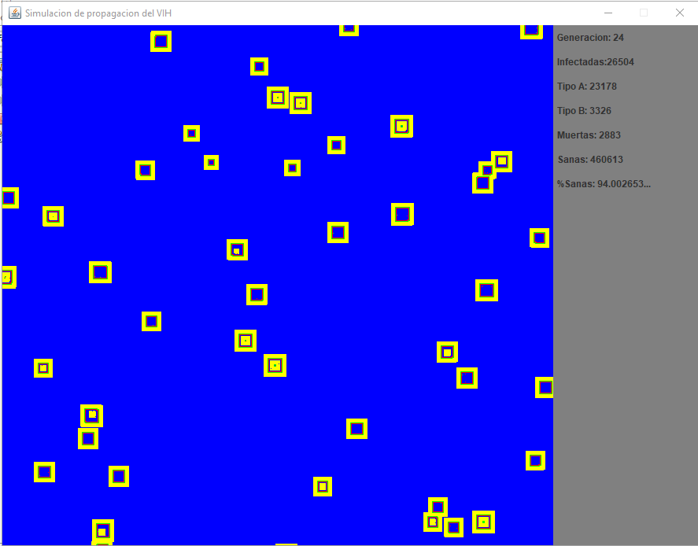

# Simulacion_VIH
Este proyecto es una simulación de propagación del VIH por el sistema inmune utilizando automatas celulares, 
basado en el artículo "On cell resistance and immune response time lag in a model for the HIV infection"
publicado por Guillermo Solovey, Fernando Peruani, Silvina Ponce Dawson, Rita Maria Zorzenon dos Santos.

[Articulo](https://github.com/luis-ale-117/Simulacion_VIH/blob/main/Recursos/SIMULACION%20VIH.pdf)
## Funcionamiento
Una matriz de 700x700 pixeles como tamaño predeterminado simula el sistema inmune de la persona.
Cada pixel representa una celula del sistema inmune, la cual puede estar en 4 estados posibles:
- Sana
- Infectada tipo A (Infecta más facilmente celulas sanas vecinas)
- Infectada tipo B (Dificilmente infecta celulas sanas vecinas)
- Muerta

La matriz tiene un porcentaje de celulas infectadas aleatoriamente.
## Demostración
Cuando la resistencia a ser contagiadas por celulas infectadas tipo A es igual a 1 vecino y tipo B igual a 4 vecinos.

## Contribuciones
Cualquier Pull request que permita mejorar el funcionamiento de este proyecto es bienvenido 

## Licencia
[MIT](https://choosealicense.com/licenses/mit/)
